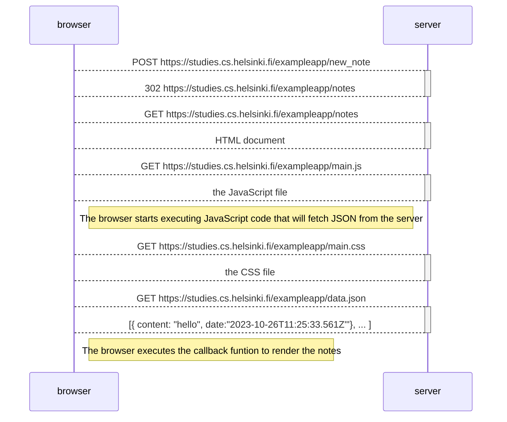

```mermaid
sequenceDiagram
    participant browser
    participant server

    browser-->server: POST https://studies.cs.helsinki.fi/exampleapp/new_note
    activate server
    server-->browser: 302  https://studies.cs.helsinki.fi/exampleapp/notes
    deactivate server

    browser-->server: GET https://studies.cs.helsinki.fi/exampleapp/notes
    activate server
    server-->browser: HTML document
    deactivate server

    browser-->server: GET https://studies.cs.helsinki.fi/exampleapp/main.js
    activate server
    server-->browser: the JavaScript file
    deactivate server

    Note right of browser: The browser starts executing JavaScript code that will fetch JSON from the server

    browser-->server: GET https://studies.cs.helsinki.fi/exampleapp/main.css
    activate server
    server-->browser: the CSS file
    deactivate server

    browser-->server: GET https://studies.cs.helsinki.fi/exampleapp/data.json
    activate server
    server-->browser: [{ content: "hello", date:"2023-10-26T11:25:33.561Z"'}, ... ]
    deactivate server

    Note right of browser: The browser executes the callback funtion to render the notes

```